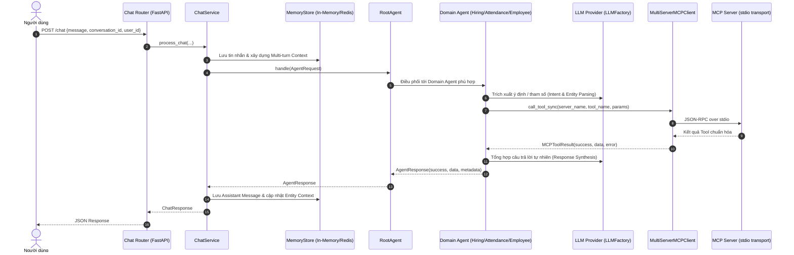

# AI Agent Platform (FME Multi-Agent System)

Nền tảng hệ thống AI Agent hỗ trợ hỏi đáp và truy vấn dữ liệu tự động cho các phân hệ nghiệp vụ doanh nghiệp (**Tuyển dụng**, **Chuyên cần**, **Nhân sự**) thông qua giao thức **Model Context Protocol (MCP)** và kiến trúc **Multi-Agent**.

---

## 1. Kiến trúc hệ thống & Luồng dữ liệu

Hệ thống được phát triển theo đúng chuẩn kiến trúc phân lớp từ `docs/AI_Plan.pdf`:

### 1.1. Sơ đồ tuần tự (Sequence Diagram)


### 1.2. Nguyên tắc phân chia trách nhiệm (Separation of Concerns)
- **Controller / Router** (`apps/chatbot/routers/`): Tiếp nhận request HTTP, kiểm tra quyền sở hữu `user_id`, validate schema Pydantic.
- **Service Layer** (`apps/chatbot/services/`): Quản lý luồng nghiệp vụ chat, bóc tách lỗi, lưu trữ lịch sử và ngữ cảnh đa lượt.
- **Root Agent** (`agents/root/`): Phân loại câu hỏi thuộc phân hệ nào và chuyển tiếp tới Domain Agent tương ứng.
- **Domain Agents** (`agents/hiring/`, `agents/attendance/`, `agents/employee/`): Nhận request, phối hợp với LLM để bóc tách tham số và gọi MCP Tool qua MCP Client.
- **MCP Client** (`shared/clients/`): Quản lý kết nối tới các MCP Server qua giao thức `stdio`, xử lý chuyển đổi kết quả chuẩn hóa `MCPToolResult`.
- **MCP Servers & Tools** (`mcp_servers/`): Cung cấp các công cụ tra cứu nghiệp vụ độc lập, giao tiếp chuẩn MCP.
- **Function Support**: Tầng truy xuất dữ liệu nghiệp vụ (hỗ trợ chuyển đổi giữa Mock Data và REST API backend thật).
- **LLM Layer** (`shared/llm/`): Factory hỗ trợ OpenAI, Groq, Ollama, HuggingFace và MockLLM phục vụ test offline.
- **Memory & Cache** (`shared/memory/`, `shared/cache/`): Quản lý lịch sử trò chuyện đa lượt, entity context theo user và cache RAM có TTL.

---

## 2. Cấu trúc thư mục dự án

```
AI Agent platform/
├── apps/
│   └── chatbot/                  # Chat API (FastAPI) & Static Web UI
│       ├── routers/              # chat.py, conversations.py (User Isolation & IDOR protection)
│       ├── services/             # chat_service.py (Business Logic Service Layer)
│       ├── static/               # HTML/CSS/JS Chatbot Web UI
│       ├── agent_setup.py        # Dependency Injection (MCPClient + LLMFactory -> Agents)
│       └── memory_store.py       # Memory Store Adapter
├── agents/                       # Domain Agents kế thừa BaseAgent
│   ├── root/                     # Root Agent điều phối, AgentRegistry
│   ├── hiring/                   # Hiring Agent (Phân hệ Tuyển dụng)
│   ├── attendance/               # Attendance Agent (Phân hệ Chuyên cần)
│   └── employee/                 # Employee Agent (Phân hệ Nhân sự)
├── mcp_servers/                  # MCP Servers độc lập theo chuẩn MCP SDK
│   ├── hiring/                   # 5 Tools: Ứng viên, Lịch phỏng vấn, Vị trí tuyển dụng, Thống kê
│   ├── attendance/               # 5 Tools: Ngày công, Đi trễ, Vắng mặt, Lịch sử chấm công, Tỷ lệ chuyên cần
│   └── employee/                 # 5 Tools: Tìm nhân viên, Hồ sơ chi tiết, Phòng ban, Danh sách phòng
├── shared/                       # Module dùng chung toàn hệ thống
│   ├── abstractions/             # Interface trừu tượng (BaseAgent, BaseLLM, BaseMCPClient, MemoryStore, BaseCache)
│   ├── clients/                  # MultiServerMCPClient (kết nối đa server stdio/async)
│   ├── llm/                      # LLMFactory, Providers (OpenAI, Ollama, HuggingFace), MockLLM
│   ├── memory/                   # InMemoryStore & RedisMemoryStore (User-context & Agent-context)
│   ├── cache/                    # InMemoryCache (Hỗ trợ TTL và thread-safe)
│   └── logger/                   # Centralized logger cấu hình stream sys.stderr
├── tests/                        # 161 automated unit, benchmark & integration tests
├── docs/                         # Tài liệu đặc tả kỹ thuật dự án (AI_Plan.pdf, hiring_tools.md, etc.)
├── requirements.txt              # Thư viện phụ thuộc
├── .env.example                  # File cấu hình mẫu đầy đủ các biến môi trường
└── README.md                     # Tài liệu hướng dẫn dự án
```

---

## 3. Các phân hệ nghiệp vụ & Công cụ MCP

| Phân hệ | Agent | MCP Server | Danh sách Công cụ (MCP Tools) |
|---|---|---|---|
| **Tuyển dụng** | `HiringAgent` | `mcp_servers.hiring` | `search_candidates`, `get_candidate_detail`, `list_job_openings`, `get_interview_schedule`, `get_recruitment_summary` |
| **Chuyên cần** | `AttendanceAgent` | `mcp_servers.attendance` | `get_monthly_attendance`, `get_late_arrival_summary`, `get_attendance_history`, `get_absence_summary`, `get_attendance_statistics` |
| **Nhân sự** | `EmployeeAgent` | `mcp_servers.employee` | `search_employees`, `get_employee_profile`, `get_department_list`, `get_employee_department`, `get_employee_summary` |

---

## 4. Hướng dẫn cài đặt & Khởi chạy

### 4.1. Cài đặt môi trường
Yêu cầu Python 3.10 trở lên:
```bash
# Cài đặt thư viện phụ thuộc
pip install -r requirements.txt

# Thiết lập file cấu hình môi trường
cp .env.example .env
```

### 4.2. Cấu hình LLM Provider (trong file `.env`)
Hệ thống hỗ trợ cả chế độ có API Key và không có API Key:
```ini
# Chế độ LLM thật (OpenAI / Groq)
LLM_PROVIDER=openai
OPENAI_API_KEY=your_openai_api_key_here
OPENAI_MODEL=gpt-4o-mini

# Chế độ Mock LLM / Rule-based (không tốn phí API, chạy offline hoàn toàn)
# LLM_PROVIDER=mock
```
*(Nếu không có API Key, các Agent sẽ tự động chạy chế độ Rule-based matcher offline mà không làm gián đoạn hệ thống).*

### 4.3. Khởi chạy Chat API & Giao diện Web
```bash
uvicorn apps.chatbot.main:app --reload --port 8000
```
- **Web Demo UI**: Truy cập [http://localhost:8000](http://localhost:8000)
- **Interactive Swagger Docs**: Truy cập [http://localhost:8000/docs](http://localhost:8000/docs)

---

## 5. Kiểm thử tự động (Automated Testing)

Toàn bộ hệ thống được bảo vệ bởi **161 unit, integration và benchmark tests**, chạy độc lập và không phụ thuộc dịch vụ ngoài:

```bash
python -m pytest tests/ -v
```

Kết quả:
```
============================ 161 passed in ~18s =============================
```

Các bộ test chính:
- `tests/test_chatbot_api.py`: Kiểm thử API endpoint `/chat`, `/conversations`, CRUD, user isolation và bảo mật IDOR.
- `tests/test_cache.py`: Kiểm thử `InMemoryCache` TTL và thread-safety.
- `tests/test_root_agent.py`: Kiểm thử 15 kịch bản định tuyến phân hệ và câu hỏi biên.
- `tests/test_hiring_mcp.py`, `test_attendance_mcp.py`, `test_employee_mcp.py`: Kiểm thử từng MCP Tool và schema validation.
- `tests/test_agent_benchmark.py`: Benchmark hiệu năng và độ chính xác phân loại ý định.
- `shared/llm/test_llm.py`: Kiểm thử LLMFactory, MockLLM và provider error handling.

---

## 6. Khởi chạy độc lập từng MCP Server

Bạn có thể chạy độc lập từng MCP Server để kiểm thử với **MCP Inspector**:

```bash
# Hiring Server
python -m mcp_servers.hiring.server --transport stdio

# Attendance Server
python -m mcp_servers.attendance.server --transport stdio

# Employee Server
python -m mcp_servers.employee.server --transport stdio
```

Kiểm thử giao diện trực quan với MCP Inspector:
```bash
npx @modelcontextprotocol/inspector python -m mcp_servers.hiring.server
```
