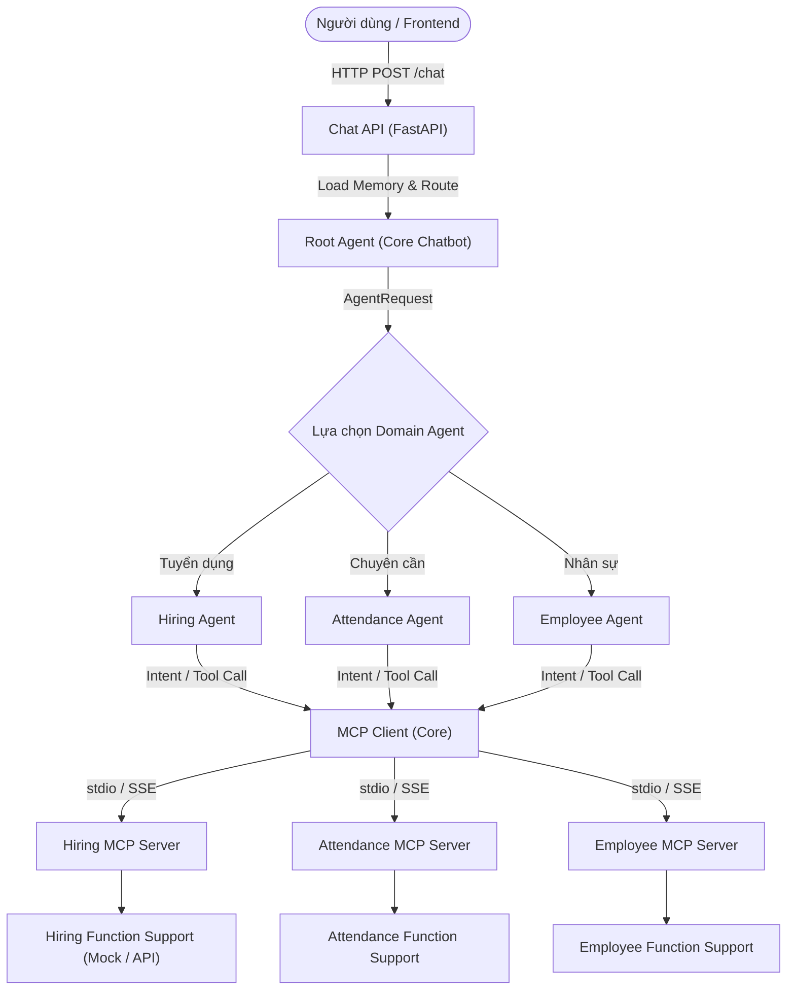

# AI Agent Platform (FME AI Chatbot)

Nền tảng hệ thống AI Agent hỗ trợ hỏi đáp và truy vấn dữ liệu tự động cho các phân hệ nghiệp vụ doanh nghiệp (Tuyển dụng, Chuyên cần, Nhân sự) thông qua giao thức **Model Context Protocol (MCP)** và kiến trúc **Multi-Agent**.

---

## 1. Tổng quan dự án

Hệ thống được phát triển bởi nhóm thực tập sinh dự án AI Agent Platform (9 thành viên). Mục tiêu trọng tâm là hoàn thiện luồng xử lý từ đầu vào người dùng đến các công cụ phân hệ:



### Nguyên tắc phân chia trách nhiệm (`docs/AI_Plan.pdf`):
- **Business Logic**: Nằm tại `Function Support` của từng phân hệ (Mock data hoặc REST API backend).
- **Giao tiếp Tool**: Nằm tại `MCP Server` và các `MCP Tool` tương ứng.
- **Phân tích yêu cầu & chọn Tool**: Nằm tại `Agent` của từng phân hệ.
- **Điều phối Agent**: Nằm tại `Root Agent`.
- **Hội thoại, Quản lý Session & API Gateway**: Nằm tại `Core Chatbot`.

---

## 2. Cấu trúc thư mục dự án

```
AI Agent platform/
├── apps/
│   └── chatbot/                  # Chat API (FastAPI), routers, services
├── agents/                       # Các Domain Agents kế thừa BaseAgent
│   ├── root/                     # Root Agent điều phối (Core Chatbot)
│   ├── hiring/                   # Hiring Agent (Phân hệ Tuyển dụng - Đã hoàn thiện)
│   ├── attendance/               # Attendance Agent (Phân hệ Chuyên cần)
│   └── employee/                 # Employee Agent (Phân hệ Nhân sự)
├── mcp_servers/                  # Các MCP Server độc lập theo chuẩn MCP
│   ├── hiring/                   # Hiring MCP Server & 5 Tools (Đã hoàn thiện)
│   ├── attendance/               # Attendance MCP Server & Tools
│   └── employee/                 # Employee MCP Server & Tools
├── shared/                       # Thư viện & Abstractions dùng chung toàn hệ thống
│   ├── abstractions/             # Interfaces trừu tượng bắt buộc tuân thủ
│   │   ├── agent.py              # BaseAgent, AgentRequest, AgentResponse
│   │   ├── memory.py             # BaseMemoryStore
│   │   ├── llm.py                # BaseLLM, LLMRequest, LLMResponse
│   │   ├── cache.py              # BaseCache
│   │   └── mcp_client.py         # BaseMCPClient, ToolDefinition, MCPToolResult
│   ├── llm/                      # LLM Factory & Provider implementations
│   ├── memory/                   # InMemoryStore & RedisMemoryStore
│   └── cache/                    # In-memory & Redis Cache
├── tests/                        # Bộ kiểm thử tự động (Pytest)
│   ├── test_hiring_mcp.py        # 6 unit tests cho MCP Tools & Validators
│   └── test_hiring_agent.py      # 8 unit tests cho Hiring Agent
├── docs/                         # Tài liệu đặc tả kỹ thuật dự án
│   ├── AI_Plan.pdf               # Bản thảo kế hoạch hệ thống tổng thể
│   ├── hiring_tools.md           # Đặc tả chi tiết 5 MCP Tools Tuyển dụng
│   └── AI Chatbot Plan.xlsx      # Kế hoạch chi tiết, tiến độ & phân công 9 thành viên
├── demo.py                       # Kịch bản demo 7 câu hỏi phân hệ Tuyển dụng
├── chat.py                       # CLI Chat tương tác thử nghiệm trực tiếp
├── requirements.txt              # Danh sách thư viện Python phụ thuộc
├── .env.example                  # Mẫu biến môi trường (API Key, URL, v.v.)
├── .gitignore                    # Bỏ qua secret (.env), cache, pycache
└── README.md                     # Tài liệu hướng dẫn dự án
```

---

## 3. Phân công nhiệm vụ thành viên (`docs/AI Chatbot Plan.xlsx`)

| STT | Phân hệ / Nhóm | Thành viên phụ trách | Nhiệm vụ chính | Mã Task | Thư mục mã nguồn |
|:---:|---|---|---|:---:|---|
| 1 | **Core Chatbot** | Lê Thị Trà My | Root Agent, routing rule-based/LLM, Agent Registry | RA-01 → RA-06 | `agents/root/` |
| 2 | **Core Chatbot** | Vũ Công Nguyên Khang | MemoryStore (In-memory, Redis), quản lý Session | MEM-01 | `shared/memory/` |
| 3 | **Core Chatbot** | Hoàng Minh Anh | LLM Interface, LLM Factory, chuẩn hóa Request/Response | LLM-01 → LLM-04 | `shared/llm/` |
| 4 | **Core Chatbot** | Thành viên 4 | FastAPI Chat endpoint (`/chat`, `/conversations`), Swagger | API-01 → API-05 | `apps/chatbot/` |
| 5 | **Core Chatbot** | Thành viên 5 | BaseCache, MCP Client kết nối đa Server qua stdio/SSE | MCP-01 → MCP-04 | `shared/cache/`, `shared/clients/` |
| 6 | **Tuyển dụng** | Nguyễn Huy Thanh | Hiring MCP Server (5 Tools), Function Support, Hiring Agent | HIR-01 → HIR-10 | `agents/hiring/`, `mcp_servers/hiring/` |
| 7 | **Chuyên cần** | Lê Hữu Thanh Vy | Attendance MCP Server, Attendance Agent | ATT-01 | `agents/attendance/`, `mcp_servers/attendance/` |
| 8 | **Nhân sự** | Hồ Tấn Dũng | Employee MCP Server, Employee Agent, bảo mật dữ liệu | EMP-01 | `agents/employee/`, `mcp_servers/employee/` |
| 9 | **OCR** | Lê Hữu Thanh Vy | OCR Service xử lý hình ảnh văn bản/hồ sơ | OCR-01 | `services/ocr/` |

---

## 4. Phân hệ Tuyển dụng (Hiring Subsystem - Đã hoàn thiện)

Phân hệ Tuyển dụng hiện đã triển khai đầy đủ cả 2 tầng:
1. **Hiring MCP Server & 5 MCP Tools**:
   - `search_candidates`: Tìm kiếm ứng viên theo từ khóa, kỹ năng, trạng thái, mã vị trí.
   - `get_candidate_detail`: Xem hồ sơ chi tiết theo `candidate_id`.
   - `list_job_openings`: Danh sách các vị trí đang mở tuyển dụng.
   - `get_interview_schedule`: Tra cứu lịch phỏng vấn theo ứng viên hoặc khoảng thời gian.
   - `get_recruitment_summary`: Thống kê tổng hợp số liệu tuyển dụng.
2. **Hiring Agent**: Tích hợp cả LLM intent extraction và fallback rule-based matcher offline, hỗ trợ phản hồi ngôn ngữ tự nhiên tiếng Việt mượt mà.

---

## 5. Quy tắc phối hợp & Quy ước Git dành cho thành viên

Để tránh xung đột code (conflict) và đảm bảo tính nhất quán của hệ thống:

### 5.1. Quy tắc Interface dùng chung (`shared/abstractions/`)
- **TUYỆT ĐỐI KHÔNG tự ý chỉnh sửa** các file trong `shared/abstractions/` (`agent.py`, `memory.py`, `llm.py`, `cache.py`, `mcp_client.py`).
- Mọi thay đổi về input/output/methods của interface chung **phải được thảo luận và thống nhất với cả nhóm** trước khi sửa.

### 5.2. Chuẩn dữ liệu MCP Response (`docs/AI_Plan.pdf`, trang 16)
Mọi MCP Tool của tất cả các phân hệ đều phải trả về định dạng chuẩn:
```json
{
  "success": true,
  "data": {},
  "error": null,
  "metadata": {
    "source": "ten_phan_he"
  }
}
```

### 5.3. Quy trình đẩy code lên GitHub
1. Clone repository về máy:
   ```bash
   git clone https://github.com/ahuhu789/ai-agent-platform.git
   cd ai-agent-platform
   ```
2. Tạo branch mới cho tính năng của bạn:
   ```bash
   git checkout -b feature/<ten-thanh-vien>-<ten-task>
   # Ví dụ: git checkout -b feature/tra-my-root-agent
   # Ví dụ: git checkout -b feature/thanh-vy-attendance-mcp
   ```
3. Commit và push code lên branch của bạn:
   ```bash
   git add .
   git commit -m "feat(module): mo ta ngan gon thay doi"
   git push origin feature/<ten-branch>
   ```
4. Mở **Pull Request (PR)** trên GitHub để review trước khi merge vào branch `main`.

---

## 6. Hướng dẫn cài đặt & Chạy thử nghiệm

### 6.1. Cài đặt môi trường
Yêu cầu Python 3.10+:
```bash
pip install -r requirements.txt
```

Sao chép cấu hình môi trường:
```bash
cp .env.example .env
```
*(Nếu muốn Agent dùng LLM để phân tích ngữ nghĩa, điền `OPENAI_API_KEY` vào `.env`. Nếu không có key, Agent vẫn hoạt động 100% nhờ bộ rule-based matcher offline).*

### 6.2. Chạy Automated Unit Tests
Toàn bộ test suite được thiết kế chạy offline, không phụ thuộc API bên ngoài:
```bash
pytest
```
*Kết quả hiện tại: 14/14 tests pass (100%).*

### 6.3. Chạy Demo Tuyển dụng nghiệm thu (7 kịch bản)
```bash
python demo.py
```

### 6.4. Chạy CLI Chat tương tác thử nghiệm
```bash
python chat.py
```

### 6.5. Khởi chạy độc lập MCP Server Tuyển dụng
- Khởi chạy qua giao thức **stdio** (mặc định):
  ```bash
  python -m mcp_servers.hiring.server --transport stdio
  ```
- Khởi chạy qua giao thức **SSE** (HTTP Server tại port 8001):
  ```bash
  python -m mcp_servers.hiring.server --transport sse --host 0.0.0.0 --port 8001
  ```
- Kiểm thử trực quan với công cụ **MCP Inspector**:
  ```bash
  npx @modelcontextprotocol/inspector python -m mcp_servers.hiring.server
  ```
