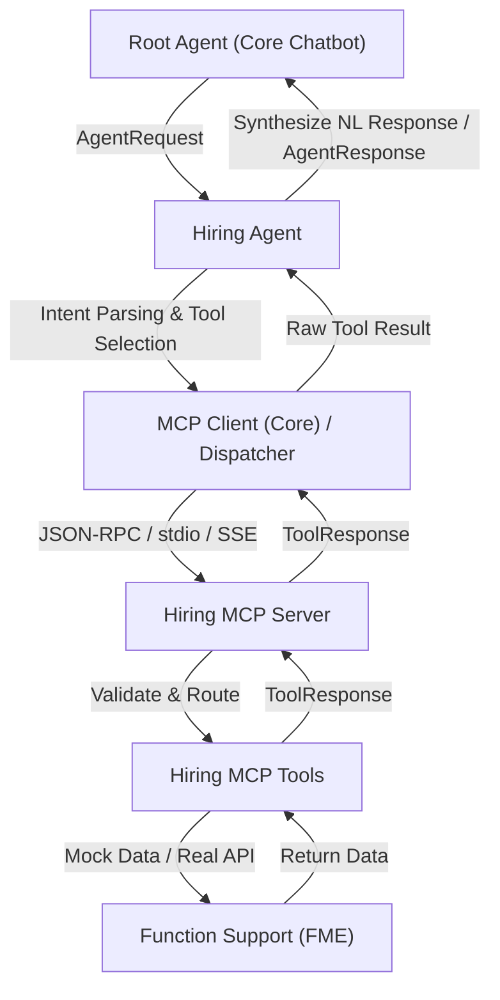

# Tài liệu Kỹ thuật: Phân hệ Tuyển dụng (Hiring MCP Server & Hiring Agent)

**Người phụ trách:** Nguyễn Huy Thanh  
**Phân hệ:** Tuyển dụng (Hiring Subsystem - FME)  
**Tài liệu tham chiếu:** `doc/AI_Plan.pdf` (Mục 3.2, 4, 5, 6)

---

## 1. Tổng quan kiến trúc

Theo thiết kế hệ thống AI Chatbot FME (`AI_Plan.pdf`), phân hệ Tuyển dụng gồm 2 tầng chính:



* **Nguyên tắc phân chia:**
  * **Business logic**: Thuộc về Function Support của phân hệ Tuyển dụng (FME).
  * **Giao tiếp MCP**: Thuộc về Hiring MCP Server và 5 Hiring MCP Tools.
  * **Phân tích yêu cầu & chọn Tool**: Thuộc về Hiring Agent.
  * **Điều phối Agent**: Thuộc về Root Agent (nhóm Core Chatbot).

---

## 2. Danh sách 5 MCP Tool Tuyển dụng

Tất cả các Tool tuân thủ chuẩn output schema thống nhất của hệ thống (`AI_Plan.pdf`, trang 16):
```json
{
  "success": true,
  "data": {},
  "error": null,
  "metadata": {
    "source": "hiring"
  }
}
```

---

### Tool 1: `search_candidates`
- **Mô tả:** Tìm kiếm danh sách ứng viên theo từ khóa (tên, email, kỹ năng), trạng thái ứng tuyển hoặc mã vị trí công việc.
- **Input Parameters:**
  - `keyword` *(string, optional)*: Từ khóa tìm kiếm (ví dụ: "Backend", "Python", "0912...").
  - `status` *(string, optional)*: Trạng thái ứng viên (`applied`, `screening`, `pending_interview`, `interviewing`, `offered`, `rejected`, `hired`).
  - `job_id` *(string, optional)*: Mã vị trí tuyển dụng (ví dụ: "JOB-001").
  - `limit` *(integer, optional, default=10)*: Số lượng kết quả tối đa.
- **Output Data Schema:**
  ```json
  {
    "candidates": [
      {
        "id": "UV001",
        "name": "Nguyễn Văn An",
        "email": "nguyenvanan@gmail.com",
        "phone": "0912345678",
        "position": "Kỹ sư Phần mềm Backend",
        "job_id": "JOB-001",
        "status": "pending_interview",
        "experience_years": 4.5,
        "skills": ["Python", "FastAPI", "PostgreSQL", "Docker"],
        "applied_date": "2026-08-08",
        "notes": "Hồ sơ đạt yêu cầu vòng loại, đang chờ xếp lịch phỏng vấn chuyên môn"
      }
    ],
    "total_found": 1
  }
  ```

---

### Tool 2: `get_candidate_detail`
- **Mô tả:** Lấy thông tin hồ sơ chi tiết của một ứng viên cụ thể bằng mã ứng viên.
- **Input Parameters:**
  - `candidate_id` *(string, required)*: Mã ứng viên bắt buộc (ví dụ: "UV001").
- **Output Data Schema:**
  ```json
  {
    "id": "UV001",
    "name": "Nguyễn Văn An",
    "email": "nguyenvanan@gmail.com",
    "phone": "0912345678",
    "position": "Kỹ sư Phần mềm Backend",
    "job_id": "JOB-001",
    "status": "pending_interview",
    "experience_years": 4.5,
    "skills": ["Python", "FastAPI", "PostgreSQL", "Docker", "REST API", "Microservices"],
    "applied_date": "2026-08-08",
    "notes": "Hồ sơ đạt yêu cầu vòng loại, đang chờ xếp lịch phỏng vấn chuyên môn"
  }
  ```

---

### Tool 3: `list_job_openings`
- **Mô tả:** Tra cứu danh sách các vị trí đang tuyển dụng hoặc theo phòng ban.
- **Input Parameters:**
  - `status` *(string, optional, default="open")*: Trạng thái vị trí (`open`, `closed`, `paused`).
  - `department` *(string, optional)*: Tên phòng ban (ví dụ: "Khối Công nghệ thông tin", "Khối Dữ liệu & AI").
  - `limit` *(integer, optional, default=10)*: Số lượng kết quả tối đa.
- **Output Data Schema:**
  ```json
  {
    "job_openings": [
      {
        "id": "JOB-001",
        "title": "Kỹ sư Phần mềm Backend",
        "department": "Khối Công nghệ thông tin",
        "open_positions": 3,
        "status": "open",
        "requirements": ["Tốt nghiệp Đại học CNTT", "Thành thạo Python, FastAPI"],
        "salary_range": "30,000,000 - 50,000,000 VND",
        "created_date": "2026-08-01"
      }
    ],
    "total_found": 1
  }
  ```

---

### Tool 4: `get_interview_schedule`
- **Mô tả:** Tra cứu lịch phỏng vấn theo mã ứng viên hoặc khoảng ngày (từ ngày đến ngày).
- **Input Parameters:**
  - `candidate_id` *(string, optional)*: Mã ứng viên (ví dụ: "UV001").
  - `from_date` *(string, optional, định dạng YYYY-MM-DD)*: Ngày bắt đầu.
  - `to_date` *(string, optional, định dạng YYYY-MM-DD)*: Ngày kết thúc.
- **Output Data Schema:**
  ```json
  {
    "schedules": [
      {
        "id": "INT-003",
        "candidate_id": "UV001",
        "candidate_name": "Nguyễn Văn An",
        "job_title": "Kỹ sư Phần mềm Backend",
        "interview_date": "2026-08-23",
        "interview_time": "10:30 - 11:30",
        "interviewer": "KS. Hoàng Mai Trang - Trưởng nhóm Kỹ thuật Backend",
        "round": 1,
        "status": "scheduled"
      }
    ],
    "total_found": 1
  }
  ```

---

### Tool 5: `get_recruitment_summary`
- **Mô tả:** Tổng hợp các chỉ số và thống kê tình hình tuyển dụng (số lượng vị trí mở, ứng viên theo trạng thái, phòng ban).
- **Input Parameters:**
  - `from_date` *(string, optional, định dạng YYYY-MM-DD)*: Ngày bắt đầu.
  - `to_date` *(string, optional, định dạng YYYY-MM-DD)*: Ngày kết thúc.
- **Output Data Schema:**
  ```json
  {
    "total_openings": 11,
    "total_candidates": 7,
    "pending_interview_count": 3,
    "interviewing_count": 1,
    "offered_count": 1,
    "rejected_count": 1,
    "hired_count": 0,
    "by_department": {
      "Khối Công nghệ thông tin": 5,
      "Khối Dữ liệu & AI": 5,
      "Phòng Nhân sự": 1,
      "Khối Vận hành": 2
    },
    "by_status": {
      "pending_interview": 3,
      "interviewing": 1,
      "offered": 1,
      "screening": 1,
      "rejected": 1
    }
  }
  ```

---

## 3. Hướng dẫn chạy và tích hợp

### Chạy Hiring MCP Server độc lập
```powershell
# Chạy với stdio transport (mặc định)
python -m mcp_servers.hiring.server --transport stdio

# Chạy với SSE transport
python -m mcp_servers.hiring.server --transport sse --host 0.0.0.0 --port 8001

# Chạy với Streamable HTTP cho MCP Client đa server
python -m mcp_servers.hiring.server --transport streamable-http --host 0.0.0.0 --port 8001
```

### Sử dụng HiringAgent trong Python (Tích hợp Root Agent)
```python
from agents.hiring.hiring_agent import HiringAgent
from shared.abstractions.agent import AgentRequest

# Khởi tạo agent
agent = HiringAgent()

# Gửi yêu cầu từ Root Agent
request = AgentRequest(
    message="Có bao nhiêu ứng viên đang chờ phỏng vấn?",
    conversation_id="conv_123",
    user_id="user_456"
)

response = agent.handle(request)
print(response.data["response"])
```

### Chạy kiểm thử tự động
```powershell
python -m pytest tests/ -v
```

### Chạy Demo nghiệm thu
```powershell
python demo.py
```
