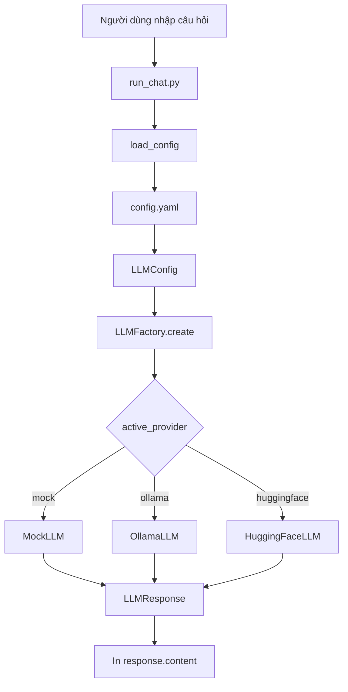

# LLM Factory

LLM Factory cung cấp một interface chung để làm việc với nhiều LLM provider:

- `mock`: provider giả lập, dùng để phát triển và kiểm thử mà không cần kết nối mạng.
- `ollama`: chạy model cục bộ thông qua Ollama.
- `huggingface`: gọi model trên Hugging Face Hub bằng API token.

Ứng dụng chỉ làm việc với `LLM`, `LLMRequest` và `LLMResponse`. Việc khởi tạo SDK cụ thể được chuyển cho `LLMFactory`, vì vậy có thể đổi provider bằng cấu hình thay vì sửa luồng chatbot.

## Cấu trúc project

```text
my_chatbot/
├── run_chat.py                 # Chương trình chatbot dòng lệnh
└── llm_factory/
	├── config.yaml             # Provider và model đang sử dụng
	├── config.py               # Đọc và kiểm tra YAML
	├── exceptions.py           # Các loại lỗi của factory
	├── factory.py              # Chọn và tạo provider
	├── interface.py            # LLMRequest, LLMResponse và interface LLM
	├── mock.py                 # Provider giả lập
	├── providers.py            # OllamaLLM và HuggingFaceLLM
	├── test_llm.py             # Test cho config, factory và provider
	└── README.md               # Tài liệu sử dụng
```

## Cài đặt

Nên chạy các lệnh sau trong virtual environment của project:

```powershell
python -m venv .venv
.\.venv\Scripts\Activate.ps1
python -m pip install --upgrade pip
python -m pip install pyyaml langchain langchain-ollama langchain-community huggingface_hub pytest
```

Nếu PowerShell chặn việc kích hoạt environment, chạy trong terminal hiện tại:

```powershell
Set-ExecutionPolicy -Scope Process -ExecutionPolicy RemoteSigned
```

## Luồng xử lý tổng thể



Chi tiết các bước:

1. `run_chat.py` gọi `load_config("llm_factory/config.yaml")`.
2. `config.py` đọc YAML, tạo `ProviderConfig` cho từng provider và kiểm tra cấu hình.
3. `LLMFactory.create(config)` đọc `active_provider` và tạo đúng implementation của `LLM`.
4. Câu hỏi được đóng gói thành `LLMRequest` với danh sách `messages`.
5. Provider thực hiện `generate(request)` và trả về `LLMResponse` thống nhất.
6. `run_chat.py` in trường `response.content` ra màn hình.

## Cấu hình provider

File `llm_factory/config.yaml` hiện có:

```yaml
active_provider: ollama
providers:
	mock:
		model: mock-model
		extra:
			response: Mock response from factory.
	ollama:
		model: llama3.2
		temperature: 0.7
		timeout: 30
```

Các trường chính:

| Trường | Ý nghĩa |
| --- | --- |
| `active_provider` | Provider được factory sử dụng |
| `model` | Tên model của provider |
| `temperature` | Mức độ ngẫu nhiên khi sinh nội dung |
| `timeout` | Thời gian chờ tối đa, tính bằng giây |
| `extra` | Tham số bổ sung riêng cho provider |

`load_config` sẽ báo `LLMConfigError` nếu file không tồn tại, YAML không hợp lệ, thiếu `providers`, provider thiếu `model`, hoặc `active_provider` không tồn tại.

## Chạy chatbot

Từ thư mục gốc `my_chatbot`:

```powershell
python run_chat.py
```

Sau đó nhập câu hỏi:

```text
You: Xin chào
AI: <câu trả lời từ model>
```

Nhập `exit` hoặc `quit` để kết thúc chương trình.

## Chạy bằng Mock provider

Mock là cách nhanh nhất để kiểm tra luồng ứng dụng. Đổi cấu hình:

```yaml
active_provider: mock
```

Chạy lại:

```powershell
python run_chat.py
```

Kết quả mặc định:

```text
You: Xin chào
AI: Mock response from factory.
```

Mock không gọi API và không cần Ollama hoặc Hugging Face token.

## Chạy bằng Ollama

1. Cài Ollama.
2. Khởi động Ollama.
3. Tải model được khai báo trong YAML:

```powershell
ollama pull llama3.2
```

4. Giữ `active_provider: ollama` và chạy:

```powershell
python run_chat.py
```

Ollama mặc định được gọi tại `http://localhost:11434`. Có thể đổi địa chỉ bằng `extra.base_url`:

```yaml
ollama:
	model: llama3.2
	temperature: 0.7
	timeout: 30
	extra:
		base_url: http://localhost:11434
```

## Sử dụng Hugging Face

Thêm provider vào `config.yaml`:

```yaml
active_provider: huggingface
providers:
	huggingface:
		model: <huggingface-model-id>
		temperature: 0.7
		timeout: 30
```

Thiết lập API token trước khi chạy. Không ghi token trực tiếp vào source code hoặc YAML:

```powershell
$env:HUGGINGFACEHUB_API_TOKEN = "your-token"
python run_chat.py
```

Nếu thiếu token, provider sẽ phát sinh `LLMProviderError`.

## Input và output chuẩn

Request gửi tới mọi provider có cùng định dạng:

```python
LLMRequest(
	messages=[
		{"role": "user", "content": "Xin chào"}
	],
	model=None,
	temperature=None,
	max_tokens=None,
)
```

Kết quả trả về có cùng định dạng:

```python
LLMResponse(
	content="Nội dung trả lời",
	model="llama3.2",
	usage=None,
	metadata={"provider": "ollama"},
)
```

Các role được hỗ trợ là `system`, `user` và `ai`. Provider sẽ chuyển đổi chúng sang định dạng phù hợp với SDK tương ứng.

Nếu `temperature` hoặc `max_tokens` được đặt trong `LLMRequest`, giá trị này sẽ ghi đè cấu hình mặc định cho lần gọi đó:

- Ollama truyền chúng qua `options.temperature` và `options.num_predict`.
- Hugging Face truyền chúng qua `temperature` và `max_new_tokens`.
- Nếu để `None`, provider sử dụng giá trị trong `config.yaml` hoặc giá trị mặc định của SDK.

## Kiểm thử

Chạy toàn bộ test:

```powershell
python -m pytest llm_factory/test_llm.py -q
```

Các test hiện có kiểm tra:

- Mock provider trả về đúng nội dung và thông tin model.
- Ollama hoạt động nếu Ollama đã được cài và đang chạy.
- Provider không tồn tại phát sinh `UnsupportedProviderError`.
- Cấu hình thiếu trường bắt buộc phát sinh `LLMConfigError`.

Test Ollama có thể được bỏ qua tự động nếu máy chưa cài lệnh `ollama`.

## Các lỗi thường gặp

| Lỗi | Nguyên nhân và cách xử lý |
| --- | --- |
| `ModuleNotFoundError: No module named 'yaml'` | Cài `pyyaml` trong đúng virtual environment |
| `Config file not found` | Chạy lệnh từ thư mục gốc project hoặc truyền đúng đường dẫn YAML |
| `Cannot connect to Ollama server` | Khởi động Ollama và kiểm tra port `11434` |
| Model không tồn tại | Chạy `ollama pull <model>` hoặc sửa tên model trong YAML |
| `HUGGINGFACEHUB_API_TOKEN ... is not set` | Thiết lập biến môi trường API token |
| `Unsupported provider` | Kiểm tra tên provider trong `active_provider` và `factory.py` |

## Mở rộng provider

Để thêm provider mới:

1. Tạo class mới kế thừa `LLM` trong `providers.py`.
2. Triển khai `generate(request) -> LLMResponse`.
3. Thêm nhánh tạo object trong `LLMFactory.create`.
4. Thêm cấu hình provider vào `config.yaml`.
5. Bổ sung test trong `test_llm.py`.

Provider mới nên chuyển mọi lỗi riêng của SDK sang các exception trong `exceptions.py`, chẳng hạn `LLMConnectionError`, `LLMTimeoutError` hoặc `LLMProviderError`.
